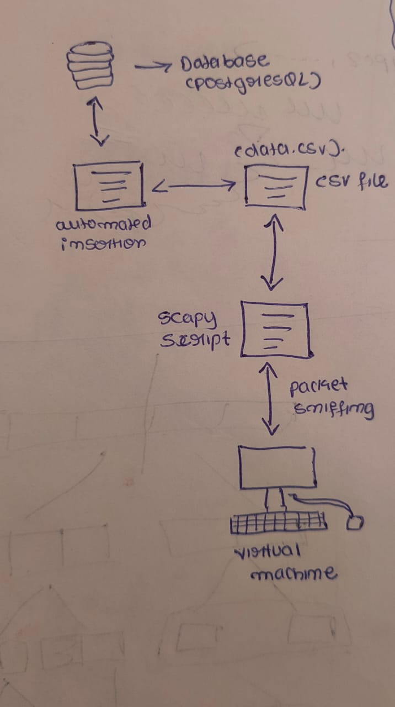

# Project Progress Report - Week 2 (Date: 08-03-2024)

# work - flow
## 1. Sniffing Packets:

### packet_sniffing.py script:
- Uses a library like Scapy or pcapy to capture network packets.
- Extracts relevant information from each packet (e.g., source/destination IPs, ports, timestamps, payload data).
- Appends the extracted information as tuples to the data.csv file.

## 2. Managing Data in CSV File:

### data.csv file:
- Stores the packet data as tuples, likely with one tuple per row.
- Truncated after a specified number of tuples are processed.

## 3. Transferring Data to PostgreSQL Database:

### _script_for_crud_operations.py script:
- Connects to the PostgreSQL database using a library like psycopg2.
- Reads the first n tuples from data.csv.
- Inserts each tuple into the relevant database table using SQL INSERT commands.
- Deletes the processed tuples from data.csv to manage file size.

 

## My Work (Date: 16-02-2024)

1. Created a virtual machine instance of Ubuntu ([Reference](https://youtu.be/hYaCCpvjsEY?si=u8PoXqS5MuIpX6ke)).
2. Installed PostgreSQL on Ubuntu ([Reference](https://youtu.be/INJl3PLVZMo?si=RmPwejbnIfHeWZYN) and [DigitalOcean Guide](https://www.digitalocean.com/community/tutorials/how-to-install-postgresql-on-ubuntu-22-04-quickstart)).
3. Installed psycopg2 and `sudo apt-get install libpq-dev` (required for psycopg2 installation).
4. Created CSV files with 5 tuples ({source_ip, dest_ip, src_port, dest_port, ip_format}).
5. Developed an automated bulk insertion script that inserts 'n' lines from a CSV file into the database (with 'n' being given by the user).
6. Wrote a packet sniffing script that uses Scapy to sniff packets from the machine and appends them to the data.csv file ([reference](https://stackoverflow.com/questions/58594332/how-do-i-write-the-data-from-scapy-into-a-csv-file) and [reference](https://www.geeksforgeeks.org/packet-sniffing-using-scapy/)).

## Additional Notes:

1. Used a shared file structure in the virtual machine, allowing the use of the same files in both the base OS (Windows in my case) and the virtual machine (Ubuntu). Steps for doing the same ([Reference](https://carleton.ca/scs/tech-support/troubleshooting-guides/creating-a-shared-folder-in-virtualbox/)):
   - Go to Devices -> Shared Folder -> Add Folder.
   - Auto_mount -> Check.
   - Click OK.

2. File handling in Python ([Reference](https://www.geeksforgeeks.org/reading-csv-files-in-python/)).

3. Scapy is a Python module used to sniff packets from computer network interfaces. We can sniff specific types of packets (IP, TCP, Ether, etc.) from specific interfaces (network interfaces available on your computer).

4. IP packets contain the 5 tuples (src_add, dest_add, src_port, dest_port, IP_protocol). Fields like src_port and dest_port are available in the IPv4 packet header, while they are not available in the header of IPv6. To access the port numbers in IPv6, we need to use the transport layer protocol headers (i.e., TCP or UDP).
