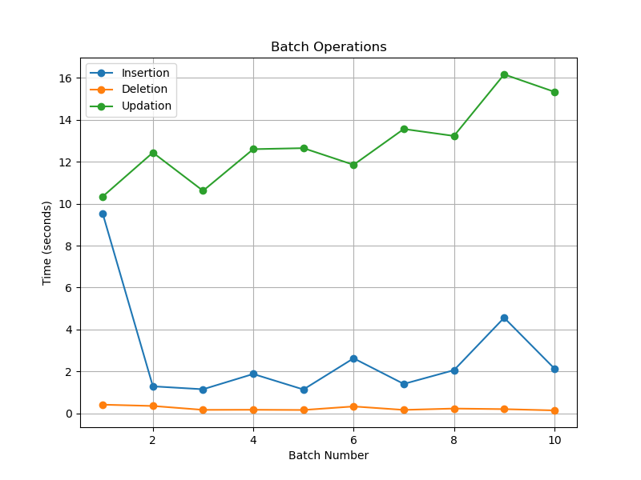
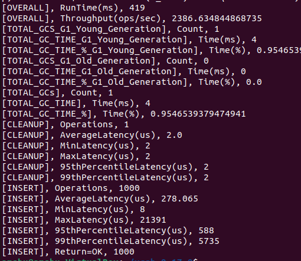
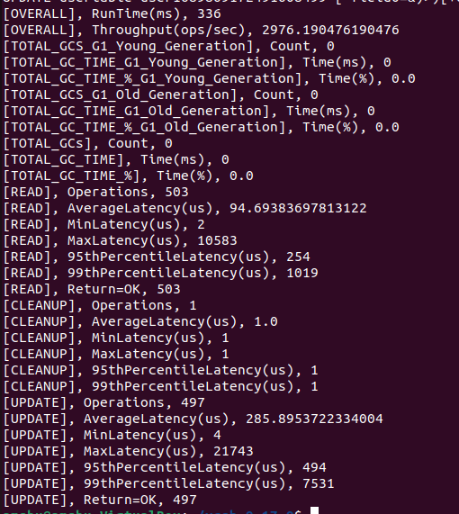
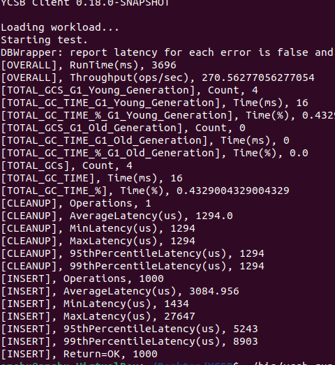
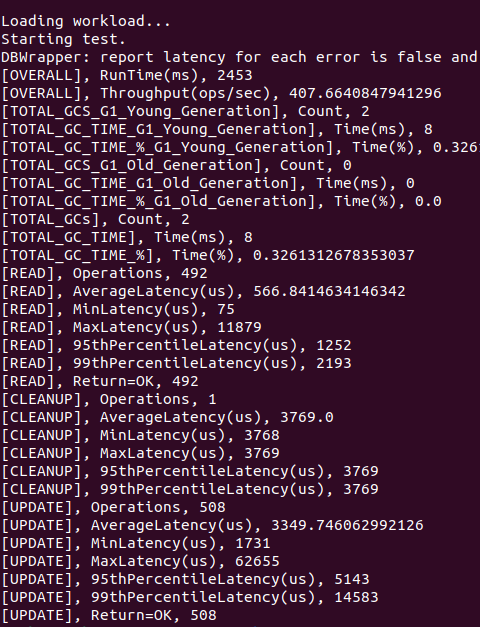

# Minutes of Meeting

- Discussed the script code and shared comments.
- Discussed checking the built-in batch transaction capability of DBs. Also, requested students to explore any methods/features provided by the respective DBs to reduce CRUD latency.
- Requested students to share the plotted graphs listing all DBs.
- Each student presented the requested data for their DBs along with the code.
- Introduced the YCSB (Yahoo! Cloud Serving Benchmark) tool to students and requested them to run the tool for their respective DBs ([Link](https://github.com/brianfrankcooper/YCSB/wiki)).

## My Work

1. Made changes to the week 4 scripts as suggested by the mentors:
   - Added try-catch blocks for error handling.
   - Attempted to optimize the query using temporary tables.
   - Added functionality to visualize the time needed for insertion, deletion, and updating in a single graph.

2. Explored the YCSB tool and learned how it is used for benchmarking.

3. Installed the YCSB tool in the virtual machine and configured it for PostgreSQL.

4. Tried out the basic load and run operations using the default workload given in the workload folder of YCSB on dummy database interface layer given by YCSB.(This is provided for testing purposes)

5. Tried out basic load and run operations using the default wokload given in the workload folder on postgres database.

### Installation Process 

- **Download the latest release of YCSB:**

```
wget https://github.com/brianfrankcooper/YCSB/releases/download/0.17.0/ycsb-0.17.0.tar.gz
tar xfvz ycsb-0.17.0.tar.gz
cd ycsb-0.17.0
```


- **Set up a database to benchmark. There is a README file under each binding directory.**
- The following commands can be used for setting up the PostgreSQL database:
  ```
  CREATE DATABASE test;
  CREATE TABLE usertable (YCSB_KEY VARCHAR(255) PRIMARY KEY not NULL, YCSB_VALUE JSONB not NULL);
  GRANT ALL PRIVILEGES ON DATABASE test to postgres;
  ```

- **Run YCSB command.**
- On Linux:
  ```
  bin/ycsb.sh load basic -P workloads/workloada
  bin/ycsb.sh run basic -P workloads/workloada
  ```

These are the common commands to test if the YCSB tool is properly working or not.

To run the tool in the respective database :

1. Compile the package using `mvn clean package`

2. Run the commands:

```
.\bin\ycsb load postgrenosql -P .\workloads\workloada -P .\postgrenosql\conf\postgrenosql.properties
.\bin\ycsb run postgrenosql -P .\workloads\workloada -P .\postgrenosql\conf\postgrenosql.properties
```

### Common Errors Encountered

1. **Maven Binding Errors:** If you try to install YCSB by cloning the GitHub repository, you might encounter errors during the compilation process (compilation is done using the command: `mvn clean package`).
- **Solution:** Download the latest version of YCSB using the link provided in the installation process. Extract it using tar.

2. **Python Syntax Error:** YCSB latest version (YCSB 0.17.0) is meant to run with Python 2, but by default Ubuntu machines execute the code in Python 3.
- **Solution:** Go to `YCSB/your_database_folder/YCSB.py`. There, in the first line, change `python` to `python2`.

3. **Java Class Exception Error:** When you try to execute `./bin/ycsb` commands, you might encounter a "java class not defined" error.
- **Solution:** Install OpenJDK-8 using the command `sudo apt install openjdk-8-jdk`.

4. **Authentication Type 10 is not Supported:** This occurs for the following reasons:
1) You have not created a database called "test" and/or have not created a table called "usertable".
2) You have not added the client IP address in the pg_hba.conf file.
3) Password authentication is not supported.

- **Solution 1:**
  1) Create a database called "test" using the command `create database test`, create a table called "usertable", and grant all privileges using the command:
     ```
     CREATE TABLE usertable (YCSB_KEY VARCHAR(255) PRIMARY KEY not NULL, YCSB_VALUE JSONB not NULL);
     GRANT ALL PRIVILEGES ON DATABASE test to postgres;
     ```
  2) Add the client IP address in the pg_hba.conf file using:
     ```
     sudo nano /etc/postgresql/<version>/main/pg_hba.conf
     ```
     and edit the file:
     ```
     # TYPE  DATABASE        USER            ADDRESS                 METHOD
     host    all             all             <client_address>        <auth_method>
     ```
  3) In the same file, change the auth method to md5.

- **Solution 2:** Go to `postgrenosql-binding/pox.xml` and edit the version of org.postgres to 42.2.24 (latest version). This will solve most of the errors in the database.

### Results

- **Common graph for insertion, deletion, and updating:**


- **YCSB tool basic load and run operations:**
1) Load operation: 


2) Run operation: 

- **For PostgreSQL DB:**
1) Load operation: 
2) Run operation: 

