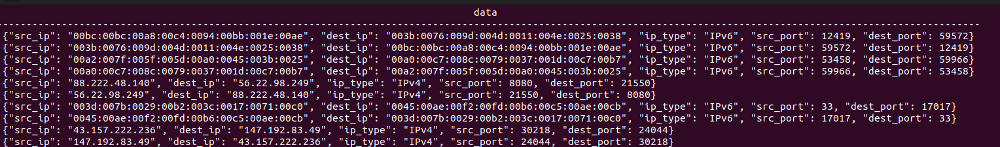
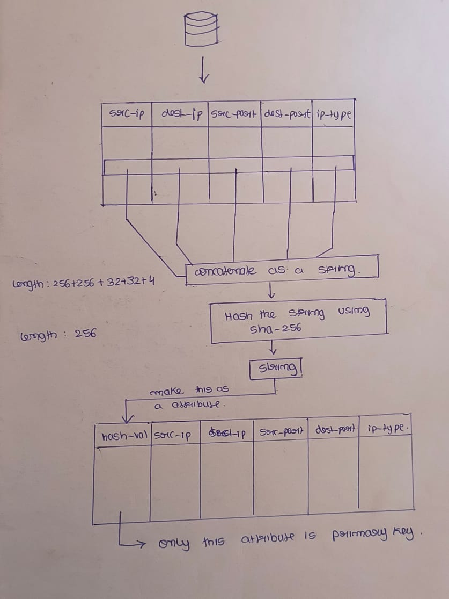

# My Work in Week 6

1. Tried out JSON data in the database.
2. Tried improving performance using the concept of hashing.
3. Tried batch operations in YCSB and explored more about it.

## Results:

1. Usage of JSON data in the database instead of strings decreased performance.
   - Possible reasons for this:
     - Using JSON data makes it difficult to declare primary keys. (The database will have no primary keys if we use JSON data directly. We have to declare objects inside a column.)

2. Performance can be improved using hashing. We can take the values of all five tuples and then hash that string using SHA-256. This will create a unique string of length 256 bits, which can be made the primary key in the table. This will increase performance as searching happens in only one column.

- Some amount of time is consumed to hash the value, but it is still better than the previous approaches.
- Partial key search time won't be affected because hash values are generated based on all five tuples. So, here partial key searching efficiency is the same as the previous approaches.
- Space utilization is more as we have to store the hash values also. (So decrease in time is accounted for by the increase in space utilization, and these trade-offs are generally seen everywhere.)
- But in conclusion, the use of hash values makes it more efficient.

3. Batch operations are possible inside the PostgreSQL binding of YCSB. For this:
   - Install the JDBC driver for PostgreSQL from the official website.
   - Add suitable commands in the `postgresql.properties` file.
   - Use the `-cp` command to specify the path to JDBC driver.
