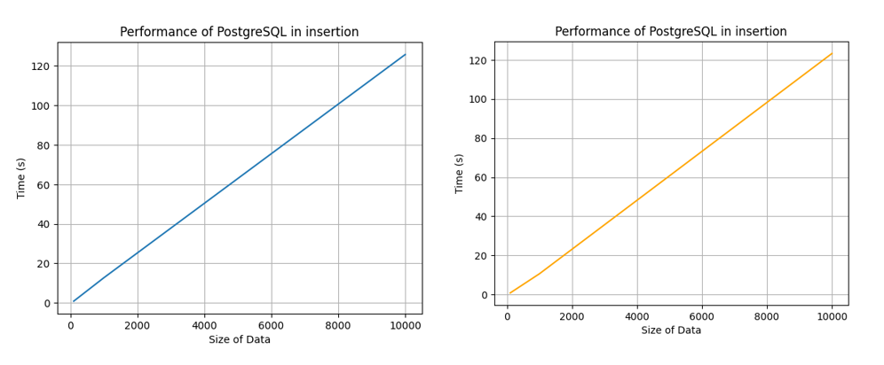

# Insertion Operations Comparison

**Note 1:** Average values (time required to insert a single record) are taken for comparison.

**Note 2:** Python script values and YCSB values are in seconds.

| Count  | Python Script Values | YCSB Values (avg latency) | Ratio  |
|--------|----------------------|-------------|--------|
| 100    | 0.000828             | 0.014673    | 17.72  |
| 1000   | 0.000712             | 0.012485    | 17.53  |
| 10000  | 0.000795             | 0.012222    | 15.37  |

**Observation:** As we could see every ratio is in the order of 10, so the Python script values match the corresponding values with YCSB tool.