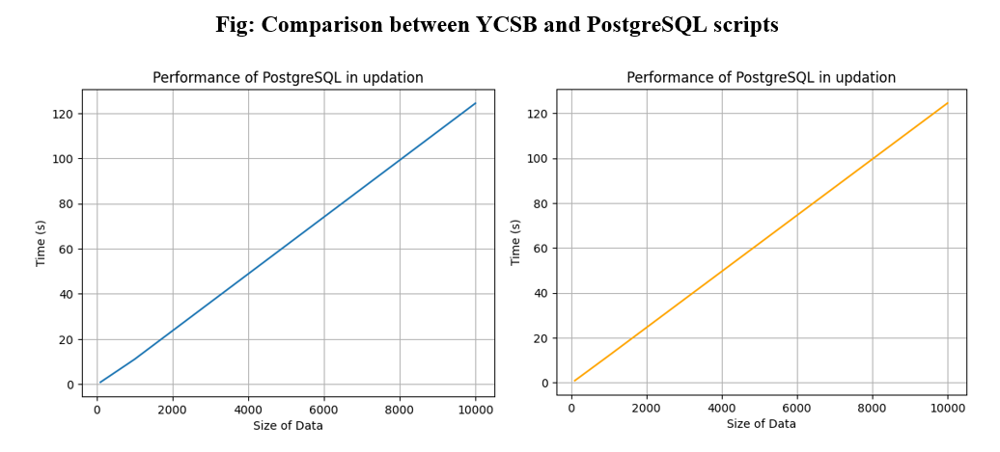

# Updation Results

**Note 1:** Average values (time required to update a single record) are taken for comparison.

**Note 2:** Python script values and YCSB values are in seconds.

| Number of tuples | Python Script Values | YCSB (avg latency) | Ratio  |
|------------------|----------------------|---------------------|--------|
| 100              | 0.83             | 0.84              | 0.98 |
| 1000             | 10.98             | 11.959             | 0.91 |
| 10000            | 124.46            | 124.63             | 0.99 |

**Observation:** As we can see, every ratio is in the order of 100, indicating that the Python script values match the corresponding values with the YCSB tool.