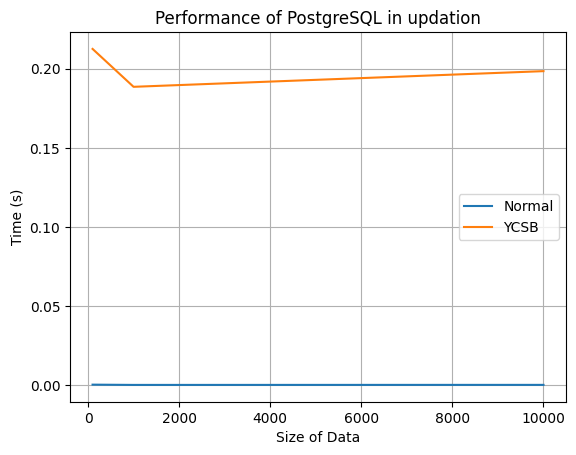

# Updation Results

| Number of tuples | Python Script Values | YCSB    | Ratio   |
|------------------|----------------------|---------|---------|
| 100              | 0.0002430            | 0.21252 | 874.56  |
| 1000             | 0.0000719            | 0.18856 | 2622.53 |
| 10000            | 0.000101             | 0.19847 | 1965.04 |

**Observation:** As we could see every ratio is in the order of 1000, so the Python script values match the corresponding values with YCSB tool.
